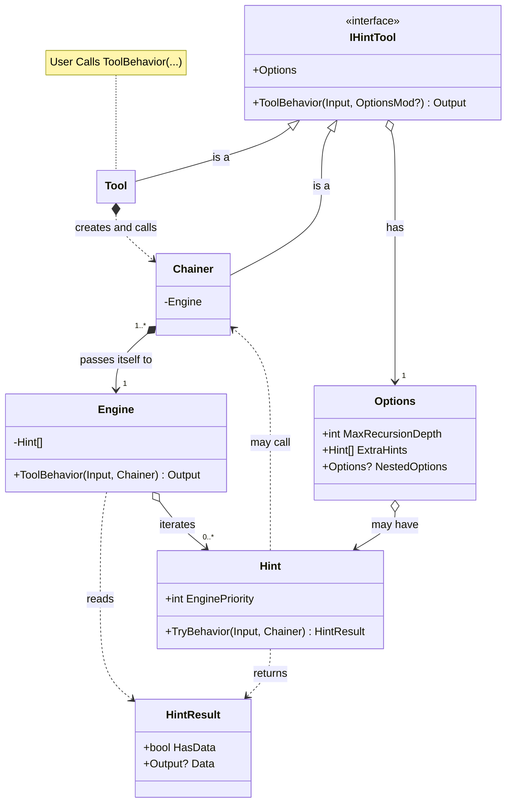

# Hint Tools

## Overview

All hint-based tools share a common architecture enforced via inheritance:

### Architecture Class Diagram

```mermaid
---
  config:
    class:
      hideEmptyMembersBox: true
---
classDiagram
    class IHintTool {
        <<interface>>
        +Options
        +ToolBehavior(Input, OptionsMod?) Output
    }
    class Options {
        +int MaxRecursionDepth
        +Hint[] ExtraHints
        +Options? NestedOptions
    }
    class Tool {}
    class Chainer {
        -Engine
    }
    class Engine {
        -Hint[]
        +ToolBehavior(Input, Chainer) Output
    }
    class Hint {
        +int EnginePriority
        +TryBehavior(Input, Chainer) HintResult
    }
    class HintResult {
        +bool HasData
        +Output? Data
    }

    note for Tool "User Calls ToolBehavior(...)"

    IHintTool <|-- Tool : is a
    IHintTool <|-- Chainer : is a
    IHintTool o--> "1" Options : has
    Tool *..> Chainer : creates and calls
    Chainer "1..*" *--> "1" Engine : passes itself to
    Hint ..> Chainer : may call
    Engine ..> HintResult : reads
    Engine o--> "0..*" Hint : iterates
    Options o--> "0..*" Hint : may have
    Hint ..> HintResult : returns
```
